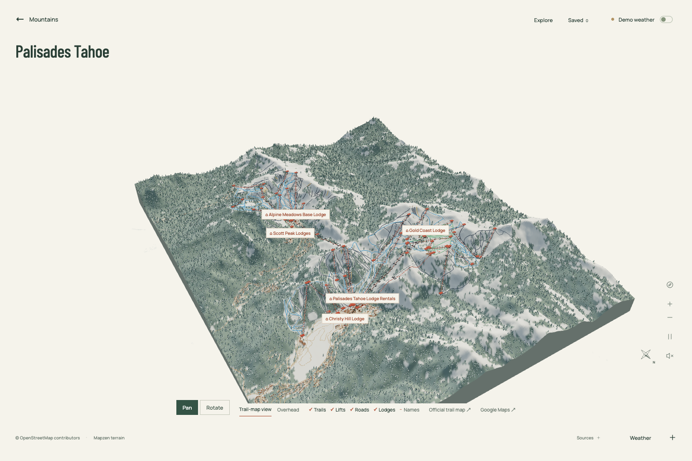
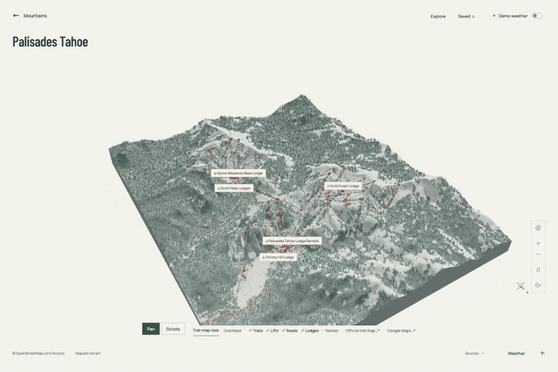
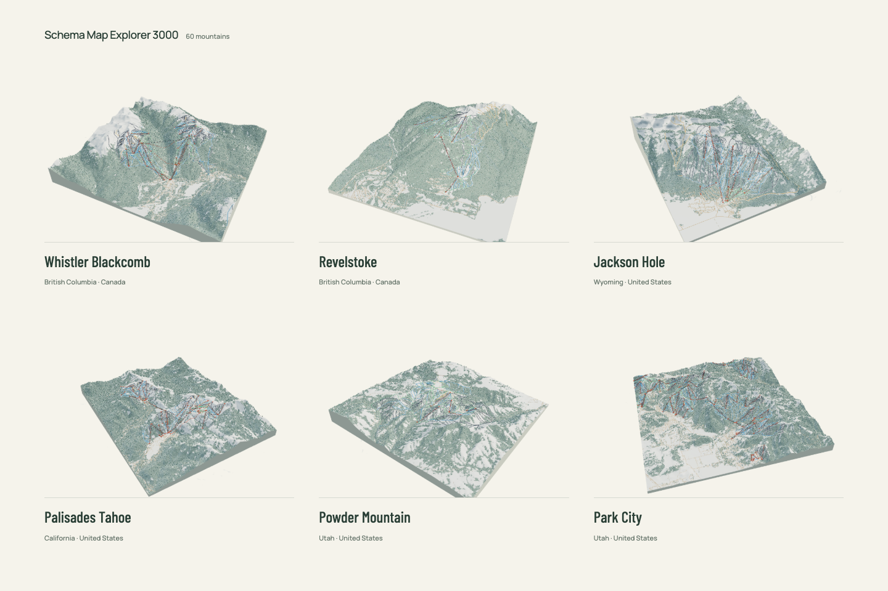

# Ski Map Explorer 3000

**Ski maps you can step into.**

An interactive 3D collection of 61 ski mountains. Explore the ridgelines, follow a familiar run, watch the lifts turn, and find somewhere to spend your next powder day.

Inspired by the artistry of painted ski trail maps, Powder Mountain’s 3D map, and the tiny skiers in Werner Bronkhorst’s paintings. Built around real geography, with a little artistic license in the snow, trees, and people.





## Explore

- **61 destinations**, including 53 across North America, plus selected mountains in the Alps and Japan.
- **Real terrain and mapped trails**, with named runs, lifts, roads, buildings, and lodge landmarks.
- **Local nature:** eight regional winter palettes, varied tree silhouettes, elevation-sensitive vegetation, and subtle wildlife you can hide in Settings. [Ecology notes](research/ECOLOGY.md) explain the references and limits.
- **Animated mountain life:** chairs, gondolas, trams, skiers, and snowboarders. Carrier capacities come from mapped tags and linked research; unknown capacities are left unmodeled.
- **Tune the mountain:** Settings offers separate skier and snowboarder visibility, size, and speed controls, saved locally.
- **Pan, orbit, zoom**, switch to an overhead view, follow a trail, or ride a lift.
- **Find your next mountain** with Ikon/Epic filters, saved favorites, and optional live snowfall forecasts.
- **A quiet collection view:** terrain portraits first, details when you want them.



The collection includes Palisades and Alpine Meadows with their Base to Base connection, Whistler, Jackson Hole, Alta, Snowbird, Mammoth, the four Aspen mountains, Big Sky, Vail, Telluride, Lake Louise, Revelstoke, and many more. Iwanai in Hokkaido includes the full mountain above its single double chair, with terrain framing for exploring the cat-ski landscape. See [Iwanai source notes](research/IWANAI.md). The [western resort manifest](research/western-resorts.json) documents the latest 42 additions.

## Run locally

Requires Node.js 22.18 or newer.

```sh
npm install
npm run dev
```

Open **http://localhost:5173**. No API key is required to explore the included maps. Live forecasts require an internet connection.

```sh
npm test       # Geographic, catalog, lift, and rider checks
npm run build # TypeScript check and production build
```

## Controls

| Action | Control |
| --- | --- |
| Move across the mountain | Drag in Pan mode (default) |
| Orbit the mountain | Right-drag, or select Rotate and drag |
| Zoom | Scroll or pinch |
| Pan with a keyboard | Focus the canvas, then use arrow keys |
| Explore on touch | One finger follows Pan / Rotate mode; two fingers pan and pinch-zoom in either mode |
| Return to the collection | Mountains button |

Select a trail, lift, or lodge to explore it. **Explore** opens the searchable map guide; **Weather** opens the forecast and timeline. Each mountain has a shareable URL, such as `/palisades`.

## How it works

TypeScript, Three.js, and Vite. Each mountain combines a 257 × 257 elevation grid with geographic trail and lift geometry, forest classification, roads, and buildings. Small repeated objects use instanced meshes. The collection uses prerendered mountain portraits; the interactive scene loads when you select a mountain.

Maps ship as static data, so exploring does not trigger live map extraction requests. Rebuild scripts, source notes, and implementation details are in the [development guide](docs/DEVELOPMENT.md).

## Data and credits

| Layer | Source |
| --- | --- |
| Elevation | [Mapzen Terrain Tiles](https://registry.opendata.aws/terrain-tiles/) and their [underlying DEM sources](https://github.com/tilezen/joerd/blob/master/docs/attribution.md) |
| Trails, lifts, roads, buildings | [© OpenStreetMap contributors](https://www.openstreetmap.org/copyright), ODbL |
| Forest cover | [ESA WorldCover 2021 v200](https://doi.org/10.5281/zenodo.7254221), CC BY 4.0 |
| Live weather forecasts | [Open-Meteo](https://open-meteo.com/en/docs), CC BY 4.0 |
| Pass affiliations | [Ikon](https://www.ikonpass.com/en/destinations) and [Epic](https://www.epicpass.com/regions.aspx) |

Lift research and official map references are linked in the geographic extracts and [research notes](research/WESTERN-EXPANSION.md). Screenshots and animation above are renders of this project. Third-party painted trail-map artwork is not included as a texture or redistributed here.

This is an exploratory art project, not an official navigation map. Community mapping can be incomplete or outdated; terrain resolution, trees, support heights, and animation are approximate. Weather is modeled forecast data, not resort-reported snowfall. **Demo weather** is imagined and labeled. Pass affiliations do not guarantee access for a particular pass tier or season.

Source datasets retain their respective licenses; see [data attribution](docs/DEVELOPMENT.md#sources-and-licensing).

On phones and tablets, swipe the map toolbar sideways for layers and map links. Settings and Explore open as scrollable panels. Layouts account for safe areas, dynamic browser height, and landscape orientation.

Direct mountain URLs such as `/breckenridge` and `/iwanai` work on refresh. `/iwawai` is an alias for Iwanai, and old hash links redirect to their clean paths. The production build includes an entry page for every mountain, so static hosts need no special SPA rewrite for these routes.
